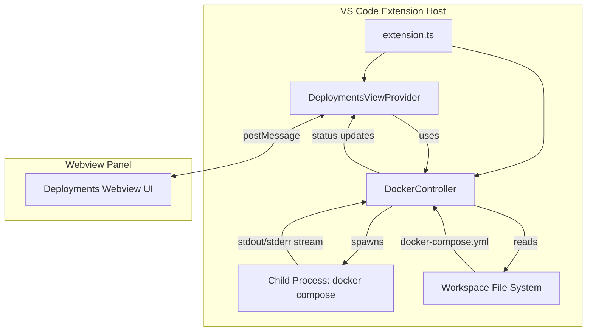
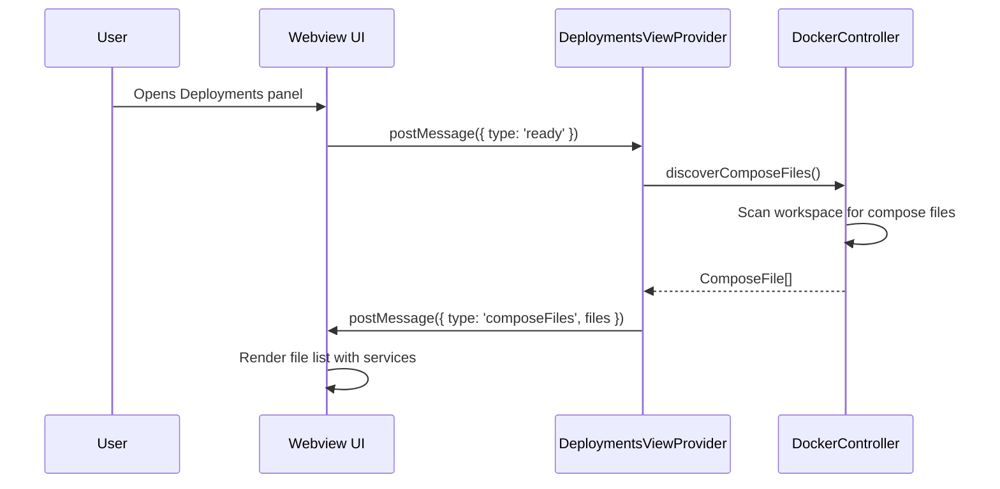
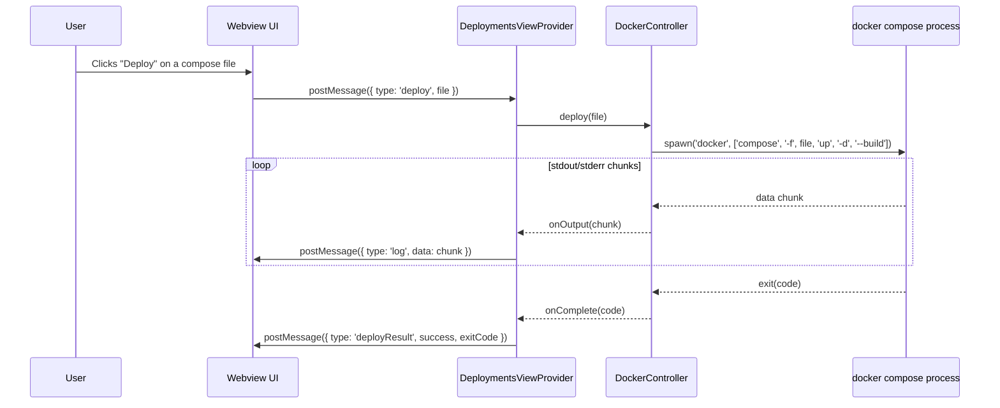
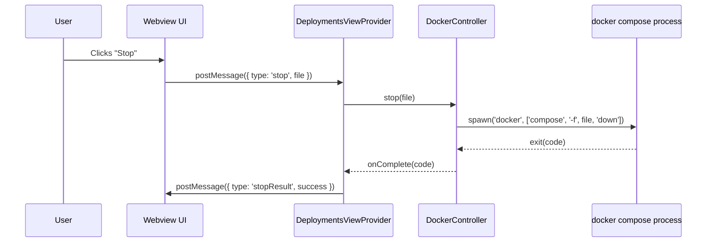

# Design Document: Docker Deployments Panel

## Overview

The Docker Deployments Panel adds a new webview-based panel to the shai-vscode extension that allows users to deploy applications from their current workspace using Docker Compose. The panel detects `docker-compose.yml` (or `docker-compose.yaml` / `compose.yml`) files in the workspace root, displays their services, and provides controls to run, stop, and monitor deployments directly from VS Code.

The feature follows the same architectural patterns as the existing `ChatViewProvider` and `ReasoningViewProvider` — a `WebviewViewProvider` registered in the activity bar's "Shai Chat" container, with a backing controller that manages Docker process lifecycle. It integrates into the extension's command system and package.json contributions.

The panel executes `docker compose -f <file> up` (and related commands) as child processes, streaming stdout/stderr back to the webview in real time so users can observe build and deployment progress without leaving the editor.

## Architecture



## Sequence Diagrams

### Discovery & Display Flow



### Deploy Flow



### Stop Flow



## Components and Interfaces

### Component 1: DeploymentsViewProvider

**Purpose**: Webview view provider that renders the deployments panel UI and bridges user interactions to the DockerController.

```typescript
interface IDeploymentsViewProvider extends vscode.WebviewViewProvider {
  resolveWebviewView(webviewView: vscode.WebviewView): void;
}
```

**Responsibilities**:
- Register as a `WebviewViewProvider` for the `shai-deployments-view` view ID
- Render HTML/CSS/JS for the deployments panel
- Handle incoming messages from the webview (deploy, stop, refresh, ready)
- Forward Docker output logs to the webview in real time
- Provide a static `openPanel()` method for standalone panel usage (consistent with ChatViewProvider pattern)

### Component 2: DockerController

**Purpose**: Manages Docker Compose process lifecycle — discovery, deployment, stopping, and log streaming.

```typescript
interface IDockerController {
  discoverComposeFiles(): Promise<ComposeFileInfo[]>;
  deploy(filePath: string, options?: DeployOptions): Promise<DeployResult>;
  stop(filePath: string): Promise<StopResult>;
  getStatus(filePath: string): DeploymentStatus;
  dispose(): void;
}
```

**Responsibilities**:
- Scan workspace for docker-compose / compose files
- Spawn `docker compose` child processes with proper arguments
- Stream stdout/stderr to registered callbacks
- Track active deployments and their status
- Kill running processes on dispose or stop
- Handle timeouts for long-running deployments

## Data Models

### ComposeFileInfo

```typescript
interface ComposeFileInfo {
  /** Absolute path to the compose file */
  filePath: string;
  /** Filename for display (e.g., "docker-compose.yml") */
  fileName: string;
  /** Relative path from workspace root */
  relativePath: string;
}
```

### DeploymentStatus

```typescript
type DeploymentStatus = 'idle' | 'deploying' | 'running' | 'stopping' | 'error';
```

### DeployOptions

```typescript
interface DeployOptions {
  /** Run in detached mode (default: true) */
  detached?: boolean;
  /** Rebuild images before starting (default: true) */
  build?: boolean;
  /** Specific services to deploy (default: all) */
  services?: string[];
}
```

### DeployResult

```typescript
interface DeployResult {
  success: boolean;
  exitCode: number;
  output: string;
}
```

### StopResult

```typescript
interface StopResult {
  success: boolean;
  exitCode: number;
}
```

**Validation Rules**:
- `filePath` must point to an existing file within the workspace
- `filePath` must end with `.yml` or `.yaml`
- `services` array, if provided, must contain non-empty strings


## Key Functions with Formal Specifications

### Function 1: discoverComposeFiles()

```typescript
async function discoverComposeFiles(): Promise<ComposeFileInfo[]>
```

**Preconditions:**
- At least one workspace folder is open in VS Code
- File system is accessible

**Postconditions:**
- Returns an array (possibly empty) of `ComposeFileInfo` objects
- Each returned file exists on disk at the time of discovery
- Files are matched against patterns: `docker-compose.yml`, `docker-compose.yaml`, `compose.yml`, `compose.yaml`
- No duplicate entries in the result
- Search is limited to workspace root (non-recursive)

**Loop Invariants:** N/A

### Function 2: deploy(filePath, options?)

```typescript
async function deploy(filePath: string, options?: DeployOptions): Promise<DeployResult>
```

**Preconditions:**
- `filePath` is a non-empty string pointing to an existing compose file
- Docker CLI (`docker`) is available on the system PATH
- No deployment is currently in progress for the same `filePath`

**Postconditions:**
- Returns a `DeployResult` with `success: true` if exit code is 0
- Returns a `DeployResult` with `success: false` and the exit code if the process fails
- The deployment status for `filePath` transitions: `idle` → `deploying` → `running` (on success) or `error` (on failure)
- All stdout/stderr output is captured in `result.output`
- The `onOutput` callback is invoked for each chunk of process output

**Loop Invariants:**
- During streaming: all previously emitted chunks remain in the accumulated output buffer

### Function 3: stop(filePath)

```typescript
async function stop(filePath: string): Promise<StopResult>
```

**Preconditions:**
- `filePath` is a non-empty string pointing to a compose file
- Docker CLI is available on the system PATH

**Postconditions:**
- Returns `StopResult` with `success: true` if `docker compose down` exits with code 0
- The deployment status for `filePath` transitions to `idle` (on success) or `error` (on failure)
- Any running child process for `filePath` is terminated

**Loop Invariants:** N/A

### Function 4: resolveWebviewView()

```typescript
function resolveWebviewView(webviewView: vscode.WebviewView): void
```

**Preconditions:**
- `webviewView` is a valid VS Code WebviewView instance
- Extension URI is available for local resource roots

**Postconditions:**
- Webview has `enableScripts: true`
- Webview HTML content is set
- Message listener is registered for incoming webview messages
- On `ready` message, compose file discovery is triggered

**Loop Invariants:** N/A

## Algorithmic Pseudocode

### Compose File Discovery Algorithm

```typescript
ALGORITHM discoverComposeFiles(workspaceFolders)
INPUT: workspaceFolders: vscode.WorkspaceFolder[]
OUTPUT: ComposeFileInfo[]

BEGIN
  IF workspaceFolders is empty THEN
    RETURN []
  END IF

  const rootUri = workspaceFolders[0].uri
  const patterns = ['docker-compose.yml', 'docker-compose.yaml', 'compose.yml', 'compose.yaml']
  const results: ComposeFileInfo[] = []

  FOR each pattern IN patterns DO
    const fileUri = vscode.Uri.joinPath(rootUri, pattern)
    TRY
      await vscode.workspace.fs.stat(fileUri)
      // File exists
      results.push({
        filePath: fileUri.fsPath,
        fileName: pattern,
        relativePath: pattern
      })
    CATCH
      // File does not exist, skip
    END TRY
  END FOR

  RETURN results
END
```

### Deploy Algorithm

```typescript
ALGORITHM deploy(filePath, options, onOutput)
INPUT: filePath: string, options: DeployOptions, onOutput: (chunk: string) => void
OUTPUT: DeployResult

BEGIN
  ASSERT fileExists(filePath)
  ASSERT status.get(filePath) !== 'deploying'

  status.set(filePath, 'deploying')

  const args = ['compose', '-f', filePath, 'up']
  IF options.detached THEN args.push('-d')
  IF options.build THEN args.push('--build')
  IF options.services?.length THEN args.push(...options.services)

  const process = spawn('docker', args, { cwd: workspaceRoot })
  let output = ''

  process.stdout.on('data', (chunk) => {
    output += chunk.toString()
    onOutput(chunk.toString())
  })

  process.stderr.on('data', (chunk) => {
    output += chunk.toString()
    onOutput(chunk.toString())
  })

  AWAIT process exit with exitCode

  IF exitCode === 0 THEN
    status.set(filePath, 'running')
    RETURN { success: true, exitCode: 0, output }
  ELSE
    status.set(filePath, 'error')
    RETURN { success: false, exitCode, output }
  END IF
END
```

### Webview Message Handling Algorithm

```typescript
ALGORITHM handleWebviewMessage(message, dockerController, webview)
INPUT: message from webview, dockerController: DockerController, webview: vscode.Webview
OUTPUT: side effects (messages posted back to webview)

BEGIN
  SWITCH message.type
    CASE 'ready':
      files = await dockerController.discoverComposeFiles()
      webview.postMessage({ type: 'composeFiles', files })

    CASE 'deploy':
      ASSERT message.file is non-empty string
      const onOutput = (chunk) => webview.postMessage({ type: 'log', data: chunk })
      result = await dockerController.deploy(message.file, { detached: true, build: true }, onOutput)
      webview.postMessage({ type: 'deployResult', success: result.success, exitCode: result.exitCode })

    CASE 'stop':
      ASSERT message.file is non-empty string
      result = await dockerController.stop(message.file)
      webview.postMessage({ type: 'stopResult', success: result.success })

    CASE 'refresh':
      files = await dockerController.discoverComposeFiles()
      webview.postMessage({ type: 'composeFiles', files })
  END SWITCH
END
```

## Example Usage

```typescript
// In extension.ts — registering the deployments panel
import { DeploymentsViewProvider } from './views/deploymentsView';
import { DockerController } from './docker/dockerController';

const dockerController = new DockerController(context);
const deploymentsViewProvider = new DeploymentsViewProvider(
  context.extensionUri,
  dockerController
);

context.subscriptions.push(
  vscode.window.registerWebviewViewProvider(
    'shai-deployments-view',
    deploymentsViewProvider,
    { webviewOptions: { retainContextWhenHidden: true } }
  )
);

// In commands.ts — registering the open deployments command
vscode.commands.registerCommand('shai-vscode.openDeployments', () => {
  DeploymentsViewProvider.openPanel(context.extensionUri, dockerController);
});
```

```typescript
// DockerController usage
const controller = new DockerController(context);

// Discover compose files
const files = await controller.discoverComposeFiles();
// => [{ filePath: '/workspace/docker-compose.yml', fileName: 'docker-compose.yml', relativePath: 'docker-compose.yml' }]

// Deploy
const result = await controller.deploy(files[0].filePath, {
  detached: true,
  build: true
});
// => { success: true, exitCode: 0, output: '...' }

// Check status
controller.getStatus(files[0].filePath);
// => 'running'

// Stop
await controller.stop(files[0].filePath);
// => { success: true, exitCode: 0 }
```

## Correctness Properties

*A property is a characteristic or behavior that should hold true across all valid executions of a system — essentially, a formal statement about what the system should do. Properties serve as the bridge between human-readable specifications and machine-verifiable correctness guarantees.*

### Property 1: Discovery completeness

*For any* workspace root containing a subset of the recognized compose file patterns (`docker-compose.yml`, `docker-compose.yaml`, `compose.yml`, `compose.yaml`), `discoverComposeFiles()` should return a `ComposeFileInfo` entry for every matching file that exists, and no entries for files that do not exist.

**Validates: Requirements 1.1, 1.2, 1.3, 1.5**

### Property 2: Discovery does not recurse into subdirectories

*For any* compose file placed in a subdirectory of the Workspace_Root, `discoverComposeFiles()` should not include that file in the result.

**Validates: Requirement 1.4**

### Property 3: Status state machine correctness

*For any* compose file path and any sequence of deploy and stop operations, the Deployment_Status should transition correctly: `idle` → `deploying` on deploy start, `deploying` → `running` on exit code 0, `deploying` → `error` on non-zero exit code, `running`/`error` → `stopping` → `idle` on successful stop, and `stopping` → `error` on failed stop. The default status for any file not yet interacted with should be `idle`.

**Validates: Requirements 2.3, 2.4, 2.5, 4.3, 4.4, 5.1, 5.2, 5.3, 9.2**

### Property 4: Output completeness

*For any* sequence of stdout and stderr chunks emitted by a docker compose process, every chunk should be forwarded to the `onOutput` callback and the concatenation of all chunks should equal the `Deploy_Result.output` field.

**Validates: Requirements 2.6, 3.1, 3.2, 3.3**

### Property 5: Concurrent deploy prevention

*For any* compose file path that is currently in `deploying` status, calling `deploy()` again for that same file should be rejected without spawning a second child process.

**Validates: Requirement 6.1**

### Property 6: Dispose cleanup

*For any* set of tracked child processes and status entries, after `dispose()` is called, all child processes should be terminated and all Deployment_Status entries should be cleared.

**Validates: Requirements 10.1, 10.2**

### Property 7: Path traversal prevention

*For any* file path that resolves to a location outside the Workspace_Root, the Docker_Controller should reject the path and not pass it to `docker compose -f`.

**Validates: Requirement 13.1**

### Property 8: Service name sanitization

*For any* user-provided service name string, the sanitized version passed to the child process should not contain shell metacharacters or command injection vectors.

**Validates: Requirement 13.3**

### Property 9: Command argument construction

*For any* valid compose file path and deploy options, the spawned `docker compose` process arguments should include `-f <filePath>`, the `up` or `down` subcommand, and the appropriate flags (`-d`, `--build`, service names) matching the provided options.

**Validates: Requirements 2.2, 4.2**

## Error Handling

### Error Scenario 1: Docker Not Installed

**Condition**: `docker` command is not found on the system PATH
**Response**: The `deploy()` and `stop()` methods catch the `ENOENT` spawn error and return a result with `success: false` and a descriptive error message
**Recovery**: The webview displays an error message instructing the user to install Docker and ensure it's on their PATH

### Error Scenario 2: No Compose File Found

**Condition**: No docker-compose / compose files exist in the workspace root
**Response**: `discoverComposeFiles()` returns an empty array
**Recovery**: The webview displays a placeholder message: "No docker-compose.yml found in workspace root"

### Error Scenario 3: Docker Compose Build/Run Failure

**Condition**: `docker compose up` exits with a non-zero exit code (e.g., build error, port conflict)
**Response**: The full stderr/stdout output is streamed to the webview log area; `DeployResult.success` is `false`
**Recovery**: User can read the logs, fix the issue, and click "Deploy" again

### Error Scenario 4: Process Timeout

**Condition**: A docker compose process runs longer than the configured timeout (default: 10 minutes)
**Response**: The child process is killed via `SIGTERM`; status transitions to `error`
**Recovery**: User is notified of the timeout and can retry

### Error Scenario 5: Concurrent Deploy Attempt

**Condition**: User clicks "Deploy" while a deployment is already in progress for the same file
**Response**: The request is rejected; the webview shows a warning that deployment is already in progress
**Recovery**: User waits for the current deployment to finish or stops it first

## Testing Strategy

### Unit Testing Approach

- Test `DockerController.discoverComposeFiles()` with mocked `vscode.workspace.fs.stat` to verify correct pattern matching and empty-result handling
- Test `DockerController.deploy()` with a mocked `spawn` to verify argument construction, status transitions, and output accumulation
- Test `DockerController.stop()` with a mocked `spawn` to verify `docker compose down` is called correctly
- Test `DeploymentsViewProvider` message handling with mocked webview to verify correct message routing

### Property-Based Testing Approach

**Property Test Library**: fast-check

- For any valid compose file path, `deploy()` followed by `stop()` always returns the status to `idle`
- For any set of compose file patterns present in the workspace, `discoverComposeFiles()` returns exactly those files (no more, no less)
- For any sequence of deploy/stop operations on different files, statuses remain independent

### Integration Testing Approach

- End-to-end test with a real `docker-compose.yml` that runs a simple container (e.g., `alpine:latest` with `sleep 5`)
- Verify the full flow: discovery → deploy → log streaming → stop → status reset

## Security Considerations

- File paths passed to `docker compose -f` are validated to be within the workspace root to prevent path traversal
- No shell mode (`shell: false`) is used when spawning processes, consistent with the existing extension pattern, to prevent command injection
- User-provided service names are sanitized before being passed as arguments
- The panel does not expose Docker credentials or environment variables in the webview

## Dependencies

- **VS Code API** (`vscode` ^1.74.0): WebviewViewProvider, workspace.fs, commands
- **Node.js child_process**: `spawn` for running docker compose commands
- **Docker CLI**: Must be installed on the user's system (not bundled)
- **Docker Compose**: v2 (integrated `docker compose` subcommand) or v1 (`docker-compose` binary)
