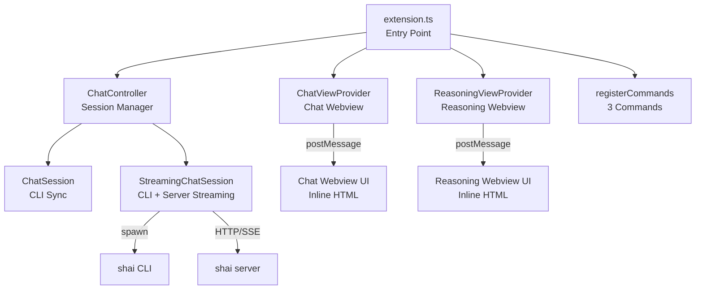
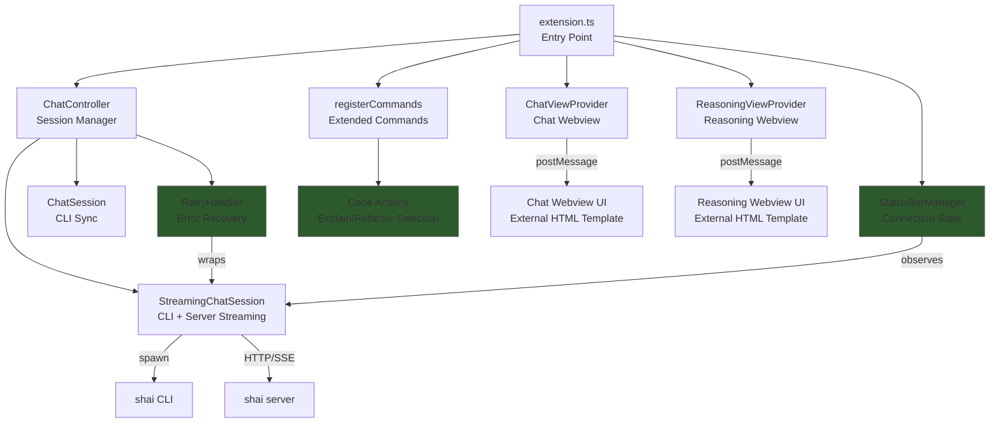
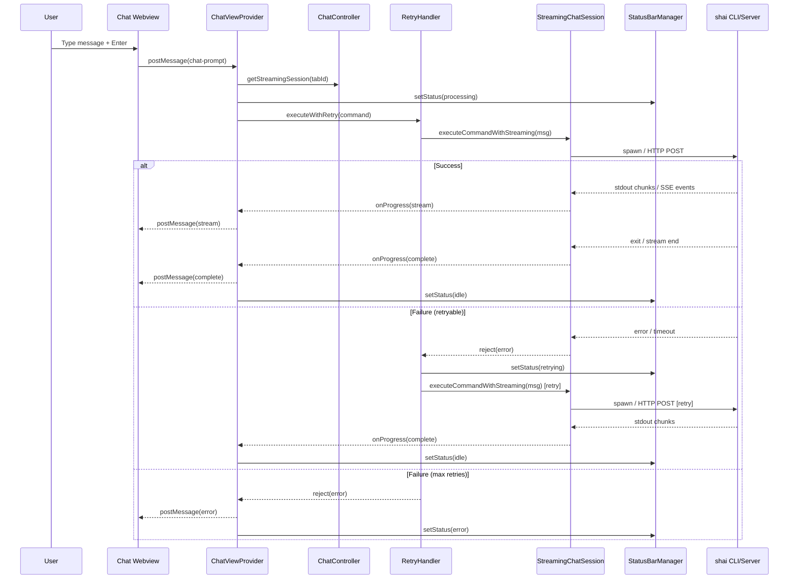
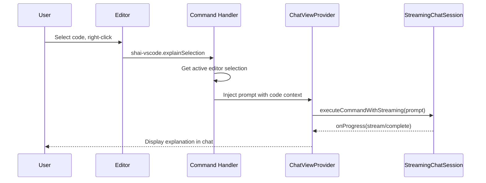

# Design Document: Shai VS Code Improvements

## Overview

The Shai VS Code extension (v0.0.2) integrates the Shai AI assistant into VS Code via a chat interface, supporting both CLI spawning and HTTP/SSE server communication modes. The extension currently provides basic chat functionality with message history persistence, real-time streaming, reasoning extraction, and cross-platform support (Windows/WSL, macOS, Linux).

This design proposes a set of tooling improvements to harden the extension for production use. The improvements focus on six areas: (1) test infrastructure, (2) error recovery and retry mechanisms, (3) code action integration for editor context, (4) status bar connection/processing indicator, (5) keyboard shortcuts, and (6) developer tooling (linting, formatting, HTML template extraction). These improvements were selected because they address the most impactful gaps in the current tooling without requiring external service changes or API migrations.

Out of scope for this iteration: multi-model/provider switching, telemetry, authentication/API key management, VS Code native Chat API migration, inline chat, and conversation export/import.

## Architecture

### Current Architecture



### Proposed Architecture



## Sequence Diagrams

### Chat Message Flow with Retry



### Code Action Flow



## Components and Interfaces

### Component 1: RetryHandler

**Purpose**: Wraps command execution with configurable retry logic and exponential backoff for transient failures (timeouts, connection errors, server 5xx).

```typescript
interface RetryOptions {
  maxRetries: number;       // default: 2
  baseDelayMs: number;      // default: 1000
  maxDelayMs: number;       // default: 10000
  retryableErrors: string[]; // error message patterns to retry on
}

interface RetryHandler {
  executeWithRetry<T>(
    operation: () => Promise<T>,
    options?: Partial<RetryOptions>
  ): Promise<T>;
}
```

**Responsibilities**:
- Classify errors as retryable vs non-retryable
- Apply exponential backoff between retries
- Emit status events for UI feedback (retrying, failed)
- Cap retries at configurable maximum

### Component 2: StatusBarManager

**Purpose**: Manages a VS Code status bar item that reflects the current connection and processing state of the Shai extension.

```typescript
type ShaiStatus = 'idle' | 'processing' | 'retrying' | 'error' | 'server-connected';

interface StatusBarManager {
  setStatus(status: ShaiStatus, detail?: string): void;
  dispose(): void;
}
```

**Responsibilities**:
- Create and manage a `vscode.StatusBarItem`
- Update icon, text, and tooltip based on state
- Show spinning icon during processing
- Show warning icon on error with tooltip detail
- Auto-clear error state after timeout

### Component 3: Code Action Commands

**Purpose**: Register editor context menu commands that send selected code to Shai with a specific prompt prefix.

```typescript
interface CodeActionCommand {
  commandId: string;
  promptPrefix: string;
  requiresSelection: boolean;
}
```

**Responsibilities**:
- Register commands: `explainSelection`, `refactorSelection`, `askAboutSelection`
- Extract selected text and language ID from active editor
- Format prompt with code context (language, file path, selection)
- Route formatted prompt to ChatViewProvider for execution
- Register context menu contributions in package.json

### Component 4: HTML Template Loader

**Purpose**: Load webview HTML from external template files instead of inline string literals, improving maintainability.

```typescript
interface TemplateLoader {
  loadTemplate(
    templateName: string,
    webview: vscode.Webview,
    extensionUri: vscode.Uri
  ): string;
}
```

**Responsibilities**:
- Read HTML files from `media/templates/` directory
- Inject CSP nonces for script security
- Resolve `vscode-resource` URIs for local assets
- Cache templates in memory after first load

## Data Models

### StatusBarState

```typescript
interface StatusBarState {
  status: ShaiStatus;
  detail?: string;
  lastUpdated: number;
}
```

**Validation Rules**:
- `status` must be one of the defined `ShaiStatus` values
- `detail` is optional, max 100 characters (status bar space constraint)
- `lastUpdated` must be a valid timestamp

### CodeActionContext

```typescript
interface CodeActionContext {
  selectedText: string;
  languageId: string;
  filePath: string;
  startLine: number;
  endLine: number;
}
```

**Validation Rules**:
- `selectedText` must be non-empty
- `languageId` must be a valid VS Code language identifier
- `startLine` <= `endLine`
- `filePath` must be a valid workspace-relative path

### RetryState

```typescript
interface RetryState {
  attempt: number;
  lastError: Error | null;
  nextDelayMs: number;
}
```

## Key Functions with Formal Specifications

### Function 1: executeWithRetry()

```typescript
async function executeWithRetry<T>(
  operation: () => Promise<T>,
  options: RetryOptions
): Promise<T>
```

**Preconditions:**
- `operation` is a callable that returns a Promise
- `options.maxRetries` >= 0
- `options.baseDelayMs` > 0
- `options.maxDelayMs` >= `options.baseDelayMs`

**Postconditions:**
- If operation succeeds on any attempt (0..maxRetries), returns the result
- If all attempts fail, throws the last error
- Total attempts = maxRetries + 1 (initial + retries)
- Only retries on errors matching `retryableErrors` patterns
- Non-retryable errors are thrown immediately without retry

**Loop Invariants:**
- `attempt` increments by 1 each iteration, 0 <= attempt <= maxRetries
- Delay between retries = min(baseDelayMs * 2^attempt, maxDelayMs)

### Function 2: buildCodeActionPrompt()

```typescript
function buildCodeActionPrompt(
  action: string,
  context: CodeActionContext
): string
```

**Preconditions:**
- `action` is one of: 'explain', 'refactor', 'ask'
- `context.selectedText` is non-empty
- `context.languageId` is a valid language identifier

**Postconditions:**
- Returns a string containing the action verb, language context, file path, and selected code
- The returned prompt is safe for shell execution (no unescaped special characters)
- The code block in the prompt preserves original indentation and whitespace

**Loop Invariants:** N/A

### Function 3: loadTemplate()

```typescript
function loadTemplate(
  templateName: string,
  webview: vscode.Webview,
  extensionUri: vscode.Uri
): string
```

**Preconditions:**
- `templateName` corresponds to an existing file in `media/templates/`
- `webview` is a valid VS Code Webview instance
- `extensionUri` is the extension's root URI

**Postconditions:**
- Returns valid HTML string with CSP nonce injected
- All `{{nonce}}` placeholders replaced with a cryptographically random nonce
- All `{{cspSource}}` placeholders replaced with `webview.cspSource`
- Template file is read synchronously and cached after first load

**Loop Invariants:** N/A

### Function 4: setStatus()

```typescript
function setStatus(status: ShaiStatus, detail?: string): void
```

**Preconditions:**
- `status` is a valid `ShaiStatus` value
- StatusBarItem has been created and not disposed

**Postconditions:**
- Status bar item text reflects the new status with appropriate icon
- Tooltip is updated with detail if provided
- If status is 'error', auto-clear timer is set (10 seconds)
- If status is 'processing', spinning animation icon is shown
- Previous auto-clear timer (if any) is cancelled

**Loop Invariants:** N/A

## Algorithmic Pseudocode

### Retry Algorithm

```typescript
async function executeWithRetry<T>(
  operation: () => Promise<T>,
  options: RetryOptions
): Promise<T> {
  // ASSERT: options.maxRetries >= 0
  // ASSERT: options.baseDelayMs > 0

  let lastError: Error | null = null;

  for (let attempt = 0; attempt <= options.maxRetries; attempt++) {
    // INVARIANT: 0 <= attempt <= options.maxRetries
    // INVARIANT: if attempt > 0, lastError is non-null
    try {
      return await operation();
    } catch (error) {
      lastError = error as Error;

      const isRetryable = options.retryableErrors.some(
        pattern => lastError!.message.includes(pattern)
      );

      if (!isRetryable || attempt === options.maxRetries) {
        throw lastError;
      }

      const delay = Math.min(
        options.baseDelayMs * Math.pow(2, attempt),
        options.maxDelayMs
      );
      await new Promise(resolve => setTimeout(resolve, delay));
    }
  }

  // ASSERT: lastError is non-null (loop exhausted)
  throw lastError!;
}
```

### Code Action Prompt Builder

```typescript
function buildCodeActionPrompt(
  action: string,
  context: CodeActionContext
): string {
  // ASSERT: action in ['explain', 'refactor', 'ask']
  // ASSERT: context.selectedText.length > 0

  const actionVerbs: Record<string, string> = {
    explain: 'Explain the following code',
    refactor: 'Suggest refactoring for the following code',
    ask: 'Answer my question about the following code',
  };

  const verb = actionVerbs[action] ?? 'Analyze the following code';
  const header = `${verb} (${context.languageId}, ${context.filePath}, lines ${context.startLine}-${context.endLine}):`;
  const codeBlock = `\`\`\`${context.languageId}\n${context.selectedText}\n\`\`\``;

  // ASSERT: result contains action verb, language, file path, and code
  return `${header}\n\n${codeBlock}`;
}
```

## Example Usage

### Retry Handler Usage

```typescript
const retryHandler = new RetryHandler({
  maxRetries: 2,
  baseDelayMs: 1000,
  maxDelayMs: 10000,
  retryableErrors: ['timed out', 'ECONNREFUSED', 'server returned 5'],
});

try {
  const result = await retryHandler.executeWithRetry(() =>
    streamingSession.executeCommandWithStreaming(message, onProgress, mode)
  );
} catch (err) {
  statusBar.setStatus('error', err.message);
}
```

### Code Action Registration

```typescript
// In registerCommands()
context.subscriptions.push(
  vscode.commands.registerCommand('shai-vscode.explainSelection', () => {
    const editor = vscode.window.activeTextEditor;
    if (!editor || editor.selection.isEmpty) {
      vscode.window.showWarningMessage('Select code first');
      return;
    }
    const ctx: CodeActionContext = {
      selectedText: editor.document.getText(editor.selection),
      languageId: editor.document.languageId,
      filePath: vscode.workspace.asRelativePath(editor.document.uri),
      startLine: editor.selection.start.line + 1,
      endLine: editor.selection.end.line + 1,
    };
    const prompt = buildCodeActionPrompt('explain', ctx);
    chatViewProvider.sendPrompt(prompt);
  })
);
```

### Status Bar Usage

```typescript
const statusBar = new StatusBarManager(context);
statusBar.setStatus('idle');

// During processing
statusBar.setStatus('processing');

// On error
statusBar.setStatus('error', 'Connection refused');

// On server mode connected
statusBar.setStatus('server-connected');
```

### Template Loading

```typescript
// In ChatViewProvider.getHtmlContent()
const html = loadTemplate('chatView', webview, this.extensionUri);
// Returns HTML with nonce and CSP source injected
```

## Correctness Properties

1. **Retry Exhaustion**: For any failed operation with `maxRetries = N`, exactly `N + 1` attempts are made before the final error is thrown.

2. **Backoff Monotonicity**: For retry attempts `i` and `j` where `i < j`, `delay(i) <= delay(j)` (delays never decrease), capped at `maxDelayMs`.

3. **Non-Retryable Immediacy**: If an error does not match any pattern in `retryableErrors`, it is thrown immediately with zero retries regardless of `maxRetries`.

4. **Status Consistency**: After any `setStatus(s)` call, `statusBarItem.text` contains the icon corresponding to status `s` until the next `setStatus` call or auto-clear.

5. **Code Action Selection Guard**: `explainSelection`, `refactorSelection`, and `askAboutSelection` commands never execute if `activeTextEditor` is undefined or `selection.isEmpty` is true.

6. **Template Nonce Uniqueness**: Each call to `loadTemplate()` generates a fresh cryptographic nonce; no two webview renders share the same nonce value.

7. **Template Idempotence**: For the same template name, `loadTemplate()` returns structurally identical HTML (modulo nonce) across calls.

## Error Handling

### Error Scenario 1: CLI Command Timeout

**Condition**: `shai` CLI process does not exit within 5 minutes
**Response**: Process is killed, error event emitted to webview, status bar shows error
**Recovery**: RetryHandler retries the command (timeout errors are retryable). After max retries, user sees error message with suggestion to check CLI installation.

### Error Scenario 2: Server Connection Refused

**Condition**: HTTP POST to `serverUrl/ask` fails with ECONNREFUSED
**Response**: Error event emitted, status bar shows error state
**Recovery**: RetryHandler retries with backoff. If server process is managed by extension, attempt to restart it. After max retries, suggest user check server configuration.

### Error Scenario 3: Empty Editor Selection for Code Action

**Condition**: User triggers code action command with no text selected
**Response**: `vscode.window.showWarningMessage` displayed, command is no-op
**Recovery**: No recovery needed; user selects text and retries.

### Error Scenario 4: Template File Missing

**Condition**: HTML template file not found in `media/templates/`
**Response**: Fall back to inline HTML string (backward compatible), log warning
**Recovery**: Extension continues to function with inline HTML. Developer is alerted via output channel.

## Testing Strategy

### Unit Testing Approach

Set up testing infrastructure using VS Code's recommended `@vscode/test-electron` runner with Mocha. Key test areas:

- **RetryHandler**: Test retry count, backoff delays, retryable vs non-retryable error classification, timeout behavior
- **buildCodeActionPrompt**: Test prompt formatting for each action type, special character handling, empty selection edge case
- **StatusBarManager**: Test state transitions, auto-clear timer, icon/text mapping
- **loadTemplate**: Test nonce injection, CSP source replacement, caching behavior, missing file fallback
- **stripAnsi**: Test ANSI escape removal across various escape sequences
- **windowsToWSLPath**: Test drive letter conversion, UNC paths, edge cases

### Property-Based Testing Approach

**Property Test Library**: fast-check

- **RetryHandler**: For any `maxRetries = N` and always-failing operation, exactly `N + 1` invocations occur
- **RetryHandler backoff**: For any sequence of retry delays, each delay is >= previous delay and <= maxDelayMs
- **buildCodeActionPrompt**: For any valid CodeActionContext, output always contains the selectedText verbatim
- **stripAnsi**: For any string without ANSI escapes, `stripAnsi(s) === s` (idempotent on clean strings)

### Integration Testing Approach

- Test full message flow from webview postMessage through ChatController to StreamingChatSession (mocking child_process.spawn)
- Test code action commands with mocked vscode.window.activeTextEditor
- Test status bar updates during streaming session lifecycle

## Performance Considerations

- Template caching: HTML templates are read from disk once and cached in a `Map<string, string>` to avoid repeated file I/O on webview creation
- Retry backoff prevents thundering herd on transient server failures
- Status bar updates are debounced (no more than one update per 100ms) to avoid flickering during rapid stream events
- No additional overhead on the hot path (streaming data flow) — retry and status bar are lightweight wrappers

## Security Considerations

- CSP nonces in webview HTML templates prevent inline script injection
- Shell argument escaping (already present) continues to protect against command injection
- Code action prompts sanitize file paths to prevent path traversal in displayed context
- Template loader only reads from the known `media/templates/` directory within the extension

## Dependencies

- **Existing**: `vscode` API, `child_process` (spawn), `os`
- **New dev dependencies**:
  - `@vscode/test-electron` — VS Code extension integration test runner
  - `mocha` + `@types/mocha` — test framework
  - `fast-check` — property-based testing
  - `eslint` + `@typescript-eslint/eslint-plugin` + `@typescript-eslint/parser` — linting
  - `prettier` — code formatting
- **No new runtime dependencies** — all improvements use VS Code built-in APIs
